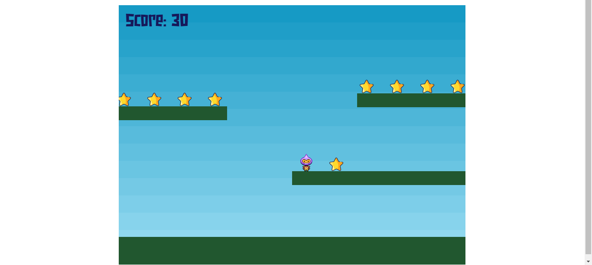

# Projeto Jogo usando a biblioteca Phaser 3

Projeto de jogo usando a biblioteca para Javascript/Typescript chamada Phaser. O jogo implementado segue o tutorial fornecido pelo site com algumas modificações. Link do tutorial: https://phaser.io/tutorials/making-your-first-phaser-3-game/part1

## Design do jogo



## Instalação da biblioteca

O phaser foi importado ao projeto via link CDN:

```
<script src="https://cdn.jsdelivr.net/npm/phaser@3.60.0/dist/phaser-arcade-physics.min.js"></script>
```

## Implementações incluídas no tutorial exemplo

- [x] Pulo com a tecla de espaço
- [x] Carregamento de fonte externa .ttf
- [x] Centralização da tela do game ao centro
